<h1 align="center">Hey 👋, Myself Sanu Samanta</h1>

<h3 align="center">
B.Tech Student • Software Developer • Problem Solver • Tech Enthusiast
</h3>

  

---

## 👨‍💻 About Me

I'm currently pursuing my **B.Tech** and have a strong interest in software development, problem-solving, and emerging technologies.

I enjoy exploring how things work, learning new concepts, and turning ideas into practical solutions through code.

> **Just give me the problem statement — it reveals my personality.**

- 🔭 Currently working on **Pathasarthy — Train ETA Prediction 2.0**
- 🌱 Currently learning **NumPy, Pandas & PyTorch**
- 🤝 Looking to collaborate on **Pathasarthy**
- 💬 Ask me about **Python**
- 🖌️ Fun fact: **I'm an Artist**

---

# 🚆 Current Project

## Pathasarthy — Train ETA Prediction 2.0

**Real-Time AI-Powered Train Delay Forecasting**

An AI-powered real-time train delay and ETA prediction system for the:

**Howrah → Bardhaman → Durgapur → Asansol → Dhanbad**

The system focuses on predicting **future destination delay**, rather than simply reporting the train's current delay.

---

# 🌐 All My Projects

---

# 📊 GitHub Analytics

## 📈 Contribution Activity

  

---

## 📊 GitHub Statistics

---

## 💻 Top Programming Languages

---

## 🔥 Contribution Streak

---

## 🐍 Commit Graph

  

---

# 🏆 GitHub Profile

---

# 🚀 Featured Projects

<table align="center">

<tr>

<td width="50%" valign="top">

<h3 align="center">🚆 Pathasarthy</h3>

AI-powered real-time train delay and ETA prediction system.

</td>

<td width="50%" valign="top">

<h3 align="center">🌐 Portfolio & Projects</h3>

A collection of my projects, experiments and development work.

</td>

</tr>

</table>

---

## 🛠️ Languages & Technologies

### 💻 Languages

  
  
  
  

### 🌐 Frontend

  
  
  
  

### 🤖 Data & AI

  
  
  
  

### ⚙️ Backend & Database

  
  

### 🛠️ Tools & Platforms

  
  
  
  

---

# 🔗 Connect With Me

<table align="center">
<tr>

<td align="center">

</td>

<td align="center">

</td>

<td align="center">

</td>

<td align="center">

</td>

<td align="center">

</td>

<td align="center">

</td>

</tr>
</table>

---

# 📬 Let's Build Something

&nbsp;&nbsp;

---

<strong>Code. Create. Learn. Repeat.</strong>

Built with curiosity, consistency and a little bit of creativity.

